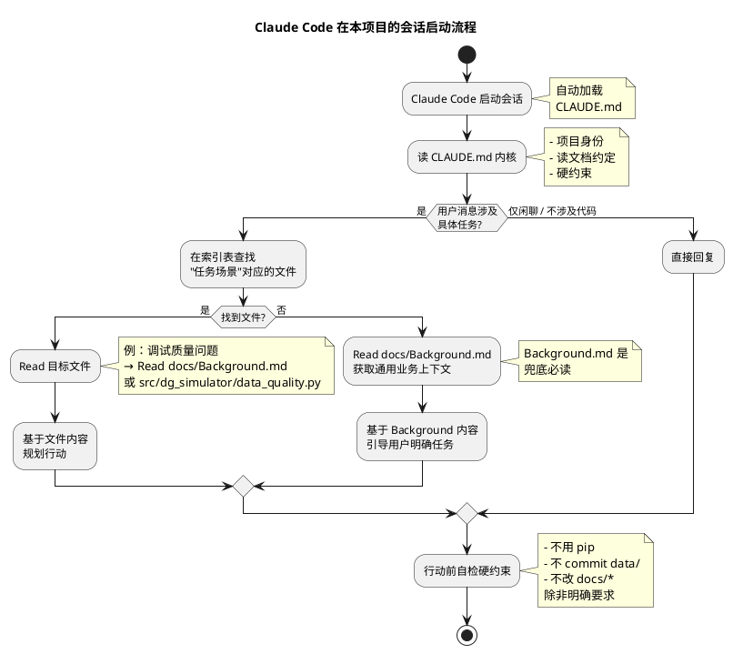

# Design — claude-md-vibe-coding

> 实现细节见本文件；动机见 `proposal.md`；行为规约见 `specs/*.md`。

## Context

**当前状态**：
- `CLAUDE.md`（120 行）已偏离"读文档 + 最小知识 + 文件索引"原则
- 6 篇 `docs/*.md`（约 110KB）是项目知识唯一权威源
- `src/dg_simulator/`、`scripts/`、`config/` 是代码入口

**约束**：
- 单一交付物：只重写 `CLAUDE.md` 一个文件
- 不得修改 `docs/*.md` 内容
- 必须保持 git 历史可回滚（`git restore CLAUDE.md` 即可还原）
- 必须立即生效（下次会话即按新结构工作）

**利益相关者**：项目开发者本人（本会话的"用户"角色）。

## Goals / Non-Goals

**Goals：**
- 把 `CLAUDE.md` 从 120 行降到 ≤ 50 行
- 内核（≤ 20 行）只放"不带文件就读不到"的硬约束
- 索引章节按"任务场景"组织文件指针，禁止内联可索引替代的内容
- 在内核顶部明示"读文档约定"——告诉 Claude 主动按需 `Read`，不要基于 CLAUDE.md 之外的猜测行动
- 文件改动具备原子性（一次 Write 即可完成）

**Non-Goals：**
- 不重写或精简 `docs/*.md`
- 不修改 `pyproject.toml`、`src/`、`scripts/`、`config/` 中任何文件
- 不引入新工具（脚本、Makefile、CI 流程）
- 不在 CLAUDE.md 中维护任何与 `docs/` 等价或重叠的章节
- 不为 CLAUDE.md 自身加版本号、变更日志、维护者签名

## Decisions

### Decision 1：两段式结构（内核 + 索引）

**选择**：CLAUDE.md 主体分为两段——
- **Kernel**（内核）：项目身份 + 读文档约定 + 硬约束
- **Index**（索引）：任务场景 → 文件指针的路由表

**备选**：
- A. 三段式（再加一段 "Glossary" 名词表）—— ❌ 名词表内容已在 `docs/Background.md` "名词术语说明"节，重复
- B. 单段全文叙述 —— ❌ 与现状无差别，不解决问题
- C. 仅保留索引，不设内核 —— ❌ 失去"硬约束兜底"价值

**理由**：内核是 Claude **必读**的硬约束（如不要 `pip install`、不要 commit `data/`），索引是 Claude **按需**的导航——两者加载时机不同，分两段能让"必读部分"在视觉上优先。

### Decision 2：按"任务场景"路由，不按"目录结构"路由

**选择**：索引表的第一列是"我想要……"（意图），第二列是指向的文件。

**示例**（最终索引表在 `specs/claude-md-doc-index/spec.md` 中定义）：
| 我想要…… | 看这个文件 |
|---|---|
| 了解项目业务背景与名词术语 | `docs/Background.md` 第 1-6 节 |
| 理解技术架构与选型理由 | `docs/Design.md` |
| 跑通 5 分钟演示 | `docs/Demo.md` |
| 安装依赖 / 部署服务 | `docs/Deps.md` |
| 排查数据质量问题 | `src/dg_simulator/data_quality.py` |
| …… | …… |

**备选**：
- A. 按目录结构路由（`docs/` 下面有什么）—— ❌ 用户视角不友好，目录结构是实现细节
- B. 按模块路由（数据生成 / 元数据 / OLAP）—— ❌ 模块边界不清晰，且与 docs 章节不对齐

**理由**：Claude 在每次会话中携带"用户意图"，按意图路由能直接命中"该读哪个文件"。

### Decision 3：硬约束只列"行为禁止项"，不列"行为允许项"

**选择**：内核中的硬约束章节只放"绝对不能做"的事（negative constraints），不放"应该做"的事（positive guidance）。

**示例**：
- ✅ `data/` 目录不提交 git
- ✅ 不得用 `pip` 安装依赖，统一用 `uv`
- ❌ ~~建议先读 docs 再动手~~（这属于"读文档约定"章节，不属于硬约束）

**理由**：positive guidance 容易随经验膨胀，negative constraints 才稳定。

### Decision 4：CLAUDE.md 维护规则

**选择**：当 `docs/` 或 `src/` 变更时：
- 变更导致某个"任务场景"无文件可指 → 必须新增索引条目
- 变更导致某个文件被废弃 → 必须删除或更新索引条目
- 变更只影响文件内容而不改变"用户可观察的入口" → **不**需要更新 CLAUDE.md

**理由**：CLAUDE.md 只关心"哪些文件存在、对应什么任务"，不关心文件内容。

### Decision 5：交付形态

**选择**：一次 `Write` 完整覆盖 `CLAUDE.md`，不采用"先建新文件再改名"的迁移方式。

**理由**：CLAUDE.md 不存在外部引用方（无 import、无 link、无 CI 检查），原子覆盖最简单；且 git 提供回滚能力。

## 读文档流程图

## Risks / Trade-offs

| 风险 | 缓解措施 |
|---|---|
| Claude 跳过索引直接猜答案 | 内核顶部"读文档约定"明示"不得假设 docs 内容已知"；索引表用 `我想要……` 开头降低猜测动机 |
| 索引条目随时间膨胀，超过 50 行预算 | spec 限制条目数 ≤ 15 条；超过时合并相近任务场景 |
| `docs/` 文件改名/移动后索引失效 | 在硬约束中加入"索引条目对应的文件必须存在"的自检；变更 docs 时同步检查 |
| Claude 不读 CLAUDE.md 内核直接看文件 | 内核长度 ≤ 20 行，加载成本可忽略；强制读内核的代价大于收益，不做强制 |
| 用户期望与索引表"任务场景"不匹配 | 索引表最后一栏加 `未列出？先问` 兜底条目，引导用户补充任务描述 |
| 现有 121 行内容删除后，Claude 失去的某些内联知识 | 关键知识已通过索引指向文件，Claude 按需读取不损失信息；非关键知识（如"看哪个 .py 文件排查问题"的兜底）保留在内核 |

## Migration Plan

1. **写入新文件**：用 `Write` 工具一次性覆盖 `CLAUDE.md`
2. **自检**：
   - 行数 ≤ 50
   - 内核部分 ≤ 20 行
   - 索引条目数 ≤ 15
   - 索引中所有文件路径在 git tree 中存在
3. **回滚策略**：`git restore CLAUDE.md` 即可（git HEAD 是 121 行原版）

## Open Questions

1. **索引粒度**：任务场景是按"用户意图"分（如"调试数据质量"）还是按"代码入口"分（如"`dg_simulator/data_quality.py`"）？—— 倾向按意图，待 `specs/claude-md-doc-index/spec.md` 落实
2. **CLAUDE.md 自身的版本控制**：是否需要"修改 CLAUDE.md 前先 Read 它"？—— 当前决策为否（CLAUDE.md 完整可见于会话，无需 Read）
3. **跨项目复用**：本设计是否需要抽象为模板？—— 当前决策为否（仅本项目）
