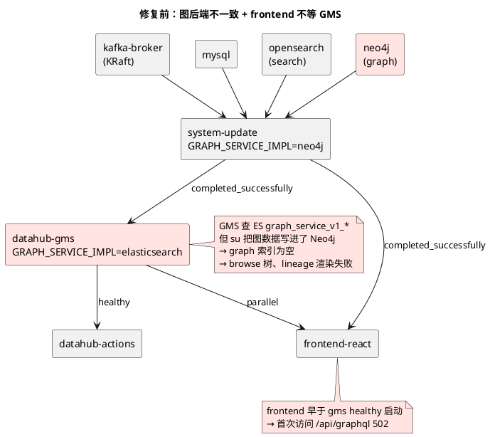
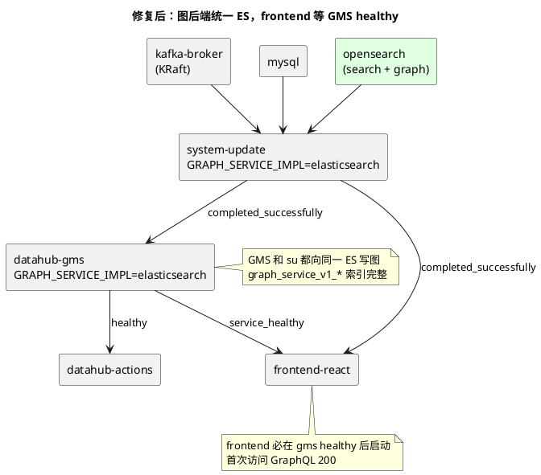
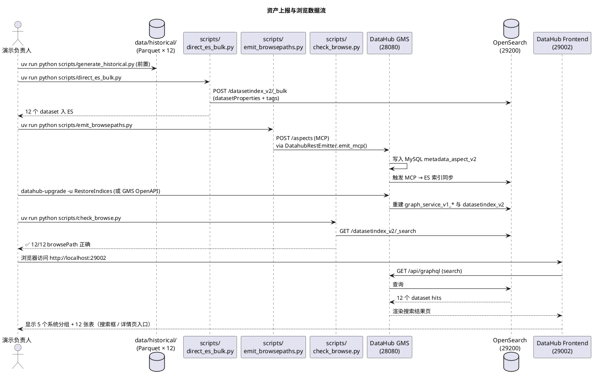
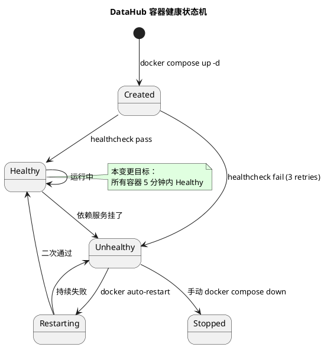

## Context

**当前状态**：
- 镜像全部已预拉取（datahub-gms/frontend-react/actions/upgrade v1.6.0、opensearch 2.19.3、kafka 8.0.0、mysql 8.2、neo4j 4.4.9-community）
- `datahub-quickstart.yml` 与 `docs/Step1.md` 记录不一致：GMS `GRAPH_SERVICE_IMPL: elasticsearch`、system-update `GRAPH_SERVICE_IMPL: neo4j`、frontend 仅依赖 system-update
- `data/historical/` 下 12 张 Parquet 表已就绪（sap_erp×6、pi_system×1、lims×1、oa×3、scada×1）
- `data/lakehouse/` 下 ODS/DWD/DWA 三层已构建
- 演示环境无任何 DataHub 容器在运行（`docker ps` 仅见 bisheng 栈）

**约束**：
- 项目 `CLAUDE.md` 硬约束：禁止 `pip`、禁止 commit `data/`、禁止改 `docs/*.md`、内存 < 16GB 禁生成历史数据
- 端口占用：bisheng 栈使用 7860/9290/19200/19300/13306/16379 等；DataHub 端口（29002/28080/29200/29092/23306/27474/27687）已避开
- 现有踩坑表（`docs/Step1.md` 第 29-37 行）记录了 5 个已修复 bug，本次不得回归

**利益相关者**：
- 演示负责人：希望 1-1.5h 内跑通"启动 + 上报 + 看到 12 张表"
- 演示受众：希望 UI 不报错、Browse 树能展开、点击资产有详情

## Goals / Non-Goals

**Goals:**
- DataHub v1.6.0 + ES（同时承担 search 和 graph）能稳定启动，所有容器 5 分钟内 healthy
- 前端在 http://localhost:29002 可正常访问，UI 框架渲染完整，无白屏/无组件加载失败
- 12 张表通过 OpenSearch 索引与 GMS 双通道上报，UI 上能 Browse、搜索、点击查看详情
- 变更可 5 分钟内回滚，`data/` 完全不受影响

**Non-Goals:**
- 重写 `emit_lineage.py` 走 GMS OpenAPI（血缘数据本变更不上报）
- Great Expectations 质量规则运行、Delta Lake 入湖、DuckDB DWA 宽表
- 引入官方 `datahub docker quickstart` CLI
- 升级 DataHub 到 v1.7+
- 演示文稿 / notebook 编写

## Decisions

### Decision 1：图后端统一为 Elasticsearch，移除 Neo4j

**选择**：GMS 与 system-update 的 `GRAPH_SERVICE_IMPL` 都设为 `elasticsearch`，删除 `datahub-quickstart.yml` 中的 `neo4j` service 与其 `datahub_neo4jdata`/`datahub_neo4jlogs` 卷。

**理由**：
- DataHub 官方明确推荐 ES 用于轻量部署（[Migrating Graph Service 文档](https://docs.datahub.com/docs/how/migrating-graph-service-implementation)："We recommend Elasticsearch for those looking for a lighter deployment"）
- 项目数据规模 12 数据集/5 边，ES 完全够用，Cypher 多跳优势用不上
- 释放 569MB 镜像 + ~1GB 内存 + 2 个 docker 卷
- 避免 `LoadIndices` 不写 Neo4j 图的隐患（[Load Indices 文档](https://docs.datahub.com/docs/how/load-indices) 明确 LoadIndices 不更新 Neo4j 图）

**备选**：
- 保留 Neo4j：需修 yml 把 GMS 的 `GRAPH_SERVICE_IMPL` 改成 `neo4j`、保 569MB 镜像与 1G 内存、保留 `emit_lineage.py` 当前 Neo4j Bolt 直写。**舍弃原因**：踩坑表显示 Neo4j healthcheck 在容器内需要 `bash /dev/tcp` hack、APOC 插件下载超时等问题；项目规模用不上 Cypher 优势。
- 改用 JanusGraph / NebulaGraph：DataHub 官方不支持，**舍弃原因**：不在 DataHub 的 graph 后端白名单。

### Decision 2：frontend 显式依赖 datahub-gms 健康

**选择**：`frontend-quickstart.depends_on` 增加 `datahub-gms-quickstart: condition: service_healthy`（同时保留 `system-update-quickstart: condition: service_completed_successfully`）。

**理由**：
- 上游官方 yml（[docker-compose.quickstart-profile.yml](https://raw.githubusercontent.com/datahub-project/datahub/master/docker/quickstart/docker-compose.quickstart-profile.yml)）的 frontend 仅依赖 system-update，是官方遗留的脆弱性：frontend 与 GMS 并行启动，浏览器首次加载 `/api/graphql` 可能 502
- 项目演示需要稳定可复现的启动效果，付出 30 秒到 1 分钟启动时间换"首次加载 200"是划算的

**备选**：
- 加 `restart: on-failure` 到 frontend 容器自愈：能部分缓解，但首次访问的用户体验已损坏，**舍弃**
- 在 frontend 加 retry 逻辑：需改镜像，**舍弃**

### Decision 3：关闭依赖图服务的 v2 重构组件

**选择**：在 `datahub-quickstart.yml` GMS 环境的 `THEME_V2_*` 与 `SHOW_*_REDESIGN` 开关中，**保留** `THEME_V2_DEFAULT: 'true'`、`THEME_V2_ENABLED: 'true'`（v2 主题整体保留），**关闭** `LINEAGE_GRAPH_V2`、`SHOW_BROWSE_V2`、`SHOW_NAV_BAR_REDESIGN`。

**理由**：
- `LINEAGE_GRAPH_V2` 与 `SHOW_BROWSE_V2` 重度依赖 graph service。在 ES 模式图索引重建完成前，启用它们会导致侧栏/血缘图渲染失败，表现为"页面不完整"
- `THEME_V2_*` 控制整体主题外观（颜色、布局），不直接依赖图服务；保留可享 v2 视觉改进
- `SHOW_NAV_BAR_REDESIGN` 文档归类在搜索栏相关，关闭可减少首次加载 JS 体积

**备选**：
- 全部关闭 v2：失去 v2 主题视觉，**舍弃**
- 全部保留 v2：回归原始 bug，**舍弃**

### Decision 4：上报路径采用 ES 直写 + GMS Aspect 双通道

**选择**：调用 `scripts/direct_es_bulk.py`（直接 bulk 写入 OpenSearch `datasetindex_v2`）和 `scripts/emit_browsepaths.py`（通过 DataHub Python SDK `DatahubRestEmitter.emit_mcp()` 走 MCP 通道写 browsePathsV2 / datasetProperties / ownership / globalTags）。

**理由**：
- 现有两个脚本已经存在（`scripts/` 目录可见），文档（`docs/Step1.md` 第 102-141 行）已记录其工作原理
- 双通道互补：直写 ES 让搜索立即可见、走 GMS SDK 让 browse 路径与 aspect 关系正确
- `direct_es_bulk.py` 的端口（29200）已经统一对齐本次修复后的 OpenSearch 配置
- **走 SDK 而非 `/openapi/v3/entity/dataset` 的原因**：v1.6.0 该端点对 dataset URN 返回 202 Accepted 但实际未生成 MCP 事件（验证发现 MySQL 无 aspect 写入）。`/aspects` 端点则因 `X-RestLi-Method` 校验返回 400。DataHub 官方 `acryl-datahub` SDK 的 `MetadataChangeProposalWrapper` + `DatahubRestEmitter.emit_mcp()` 是 v1.6.0 唯一稳定的写入路径

**备选**：
- 全部走 GMS OpenAPI：减少 ES 直写路径，但 `direct_es_bulk.py` 已存在、已被文档验证可用，**舍弃**（无收益）
- 用官方 `datahub` CLI 的 `datahub put` 命令：需 `pip install acryl-datahub`、与项目 `uv` 包管理冲突、**舍弃**

### Decision 5：图索引重建用 RestoreIndices（首次启动后）

**选择**：容器启动后通过 `datahub-upgrade` 容器（image: `acryldata/datahub-upgrade:v1.6.0`）跑 `RestoreIndices` job 重建 ES 中 `datasetindex_v2` 与 `graph_service_v1_*` 索引。

**理由**：
- 12 张表是通过直写 OpenSearch 上报的，并未走 GMS 元数据变更事件（MCP/MCE）→ ES 中 graph 索引为空 → 即便 GMS 配了 ES graph，部分跨实体查询也拿不到关系
- `RestoreIndices` 读取 MySQL `metadata_aspect_v2` 表 → 重放 MCP 事件 → 重建 ES 索引。确保 dataset 间的隐式关系（如 `BrowsePathsV2` 树结构）能被 graph service 重建
- 这是切到 ES graph 后的**官方推荐步骤**（[Migrating Graph Service 文档](https://docs.datahub.com/docs/how/migrating-graph-service-implementation) 强制要求执行）

**备选**：
- 跳过 RestoreIndices：12 张表仍可见但 Browse 树可能异常、侧栏分组可能错乱，**舍弃**
- 手动 SQL 写入 ES 索引：复杂度高、易错，**舍弃**

## Architecture Diagrams

### 图 1：修复前 vs 修复后服务依赖

### 图 2：12 张表上报与浏览的数据流

### 图 3：服务健康状态机

## Risks / Trade-offs

| 风险 | 缓解措施 |
|------|----------|
| **R1：删除 neo4j 容器后 `emit_lineage.py` 写不进去** | 1) 本变更内血缘数据本就不上报，2) 后续单独 change 改 `emit_lineage.py` 走 GMS OpenAPI，3) `docs/Step1.md` 已记录该 workaround 来源 |
| **R2：RestoreIndices 重建索引耗时** | 12 张表数据量小，重建 < 1 分钟；`batchSize=1000` 足够 |
| **R3：DataHub v1.6.0 v2 主题仍有未知 bug** | 关闭最依赖 graph 的 3 个开关，保留 v2 主题视觉；如仍有 bug，下个迭代可降级到 v0.10.x |
| **R4：端口被 bisheng 或其他服务占用** | 已通过 `docker ps` 验证无冲突；端口 29002/28080/29200/29092/23306 全部空闲 |
| **R5：MySQL 旧 schema 与 system-update 不兼容** | system-update 每次启动都跑 `DATAHUB_SQL_SETUP_ENABLED=true`，会自动迁移；若失败可 `down -v` 全清重来 |
| **R6：用户首次访问 http://localhost:29002 看到 stale bundle** | frontend-react 镜像内 React bundle 自包含，浏览器强制刷新也能加载 |
| **R7：切到 ES graph 后 Cypher 风格查询 API 不可用** | 本变更无 Cypher 查询需求；UI 上的 lineage 视图用 GMS GraphQL 接口，不依赖 Cypher |

## Migration Plan

### 部署步骤（按顺序执行）

1. **备份**：`cp datahub-quickstart.yml datahub-quickstart.yml.bak`
2. **修 yml**：
   - GMS `GRAPH_SERVICE_IMPL: elasticsearch` → 已是 ES（无需改）
   - system-update `GRAPH_SERVICE_IMPL: neo4j` → 改为 `elasticsearch`
   - system-update 删除 `NEO4J_*` 环境变量（4 行）
   - 删除整个 `neo4j:` service 块（约 45 行）
   - `frontend-quickstart.depends_on` 增加 `datahub-gms-quickstart: {condition: service_healthy, required: true}`
   - GMS 环境新增/调整：`LINEAGE_GRAPH_V2: 'false'`、`SHOW_BROWSE_V2: 'false'`、`SHOW_NAV_BAR_REDESIGN: 'false'`
3. **启动**：`docker compose -f datahub-quickstart.yml up -d`
4. **等健康**：轮询 `docker compose -f datahub-quickstart.yml ps` 直到 datahub-gms 和 frontend 显示 healthy（约 3-5 分钟）
5. **重建索引**：`docker exec datahub-datahub-upgrade-quickstart-1 bash -c "/datahub/datahub-ingestion/bin/datahub-upgrade -u RestoreIndices -a clean"`
6. **上报 12 张表**：
   - `uv run python scripts/direct_es_bulk.py`
   - `uv run python scripts/emit_browsepaths.py`
7. **验证**：
   - `uv run python scripts/check_browse.py`（应输出 12 行 ✅）
   - `curl -s "http://localhost:29200/datasetindex_v2/_count"`（应 ≥ 12）
   - 浏览器打开 http://localhost:29002（应见 v2 主题首页 + Browse 树 5 个分组）
   - 浏览器搜索"lims"（应见 1 条 hit）

### 回滚策略

| 触发条件 | 操作 | 恢复时间 |
|----------|------|----------|
| yml 改错 | `git checkout datahub-quickstart.yml` | 1 min |
| 启动后 GMS 持续 unhealthy | `docker compose -f datahub-quickstart.yml down`、yml 改回 | 3 min |
| 端口冲突 | 改 yml 端口、重启 | 5 min |
| 完全回滚（含数据） | `docker compose -f datahub-quickstart.yml down -v` | 5 min |

## Open Questions

- Q1：是否需要在本变更后立即跑 `emit_lineage.py` 写血缘？ → 暂不，列入下一个 change（避免单次变更过大）
- Q2：是否需要把 `datahub-quickstart.yml` 的修改同步到 `docs/Step1.md` 踩坑表？ → 变更完成后单独发一个 docs change 更新文档
- Q3：演示时是否要展示 5 个 v2 主题的 UI 截图？ → 暂不，演示用实时浏览器即可
- Q4：是否需要监控告警（如 GMS 挂了自动告警）？ → 本地演示无需
