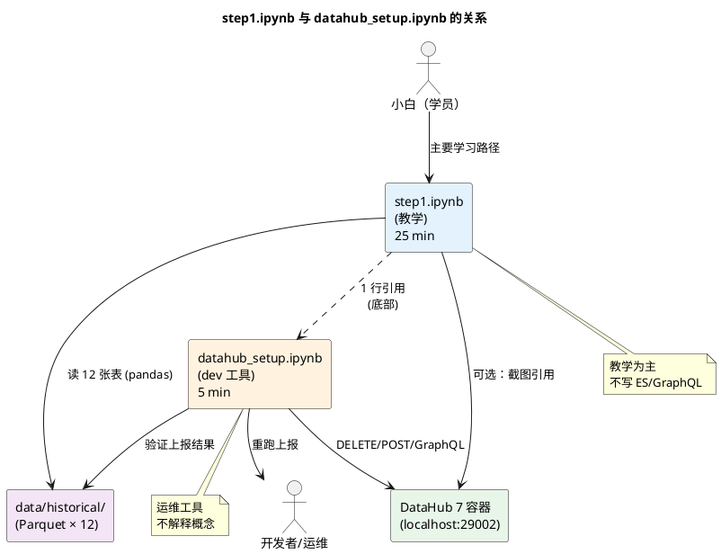
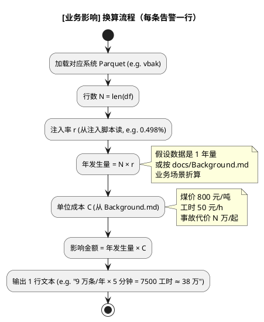

## Context

**当前状态**：
- `notebook/step1.ipynb` 共 28 个 cell，主体是 pandas 驱动的离线质量分析（前 6 节），末尾 7 个 cell（7.1~7.7）是 OpenSearch / GMS GraphQL 的开发者操作（删除 ES 文档、调用 `direct_es_bulk.py`、GraphQL 搜索验证）
- 7 容器 DataHub 栈已 healthy（`http://localhost:29002` 可访问，12 张表已在 OpenSearch `datasetindex_v2` 中）
- 项目定位是「给小白软件工程师的数据治理教学环境」（参见 `docs/Background.md` 与本变更 proposal.md 的 Why 段）
- 现有 `docs/Background.md` / `docs/Demo.md` / `docs/Deps.md` / `docs/Step1.md` 不动（CLAUDE.md 硬约束）
- `screenshots/` 目录在 `.gitignore` 中（已 gitignore，新截图不入库）

**约束**：
- notebook 是教学材料，不生产数据、不动 `data/`、不动容器
- 修改必须可回滚（`git checkout notebook/step1.ipynb` 1 分钟内回到原状）
- 业务影响换算不能凭空捏造——必须以 `data/historical/` 中各系统真实行数 × 注入率为依据
- DataHub UI 截图依赖 7 容器 healthy 状态；当前已具备
- 小白 5 分钟演示流程（参见 `docs/Demo.md`）不能因此次改造而失能——教学节奏可比"打磨"重于"压缩"

**利益相关者**：
- **小白（学员）**：首要读者；改造后应能 5 分钟内听懂"是什么、为什么、怎么用"
- **授课讲师**：备课时间不增加；旧 `step1.ipynb` 第 7 节的脚本（OpenSearch/GraphQL）仍能在 `datahub_setup.ipynb` 中找到

## Goals / Non-Goals

**Goals:**
- 砍掉 step1.ipynb 第 7.1~7.7 全部 dev 脚本 cell，迁至独立 `notebook/datahub_setup.ipynb`
- 在 step1.ipynb 开头插入 1 个「痛点故事」markdown cell（60 秒剧本，无/有可视化对照）
- 在 step1.ipynb 第 5 节（详细质量告警）每条告警后追加 `[业务影响]` 一行
- 在 step1.ipynb 第 6 节前新增一节「DataHub 是什么、怎么用」，含 1~3 张 UI 截图
- 教学节奏可读：从 30 分钟压到 25 分钟内能跟完，注意力不被中途的 dev 脚本打断

**Non-Goals:**
- step0.ipynb / step2+ notebook 改造 —— 本期不动
- `docs/Background.md` 中"业务影响换算表"沉淀 —— 需 sign-off，单开 change
- Idea 5/6（Schema preview / 教学小结卡）—— 列 Phase 2，本期不做
- 改造 screenshots/ 入库（screenshots/ 已在 .gitignore）
- 用 Playwright 重做一遍教学自动化验证（可作后续 change）
- 血缘展示、Schema 详情等 DataHub UI 高级功能截图（先用基础 3 截图打住）

## Decisions

### Decision 1：第 7 节 cell 整体迁移到新 notebook，不重写

**选择**：把 step1.ipynb 的 cell id `step1-20` 到 `step1-28` 整段（7.1~7.7）原样剪切到新文件 `notebook/datahub_setup.ipynb`，在原位置留 1 行 markdown 引用「`📘 开发者手册：datahub_setup.ipynb`」。

**理由**：
- 7.1~7.7 的代码逻辑是对的（最近一次跑通，删 12 条 / 重新 import 12 条 / ES count=12）—— 重写有引入 bug 风险
- "迁移而非重写"是 1 小时 vs 3 小时的差距
- 新 notebook 与 step1.ipynb 共享 import 与配置（`requests`、端口常量），可以**最小改动复用**

**备选**：
- **就地删除第 7 节、不迁出** —— 失 dev 教程入口，弃
- **迁出 + 改造为更通用脚本**（参数化平台/表名） —— 超本期范围，弃

### Decision 2：痛点故事用 1 个 markdown cell 写剧本，不用代码 cell

**选择**：在 step1.ipynb 第 1 个 cell（现"模块目标" cell）之前插入 1 个 markdown cell，包含 1 段 200 字内的剧本：
- **幕一**（无可视化）：新员工小王问 3 个同事得到 3 个不同的表名 → 下载错表 → 用错字段被领导骂
- **幕二**（有可视化）：同一个小王打开 step1.ipynb 搜「煤质」→ 1 分钟定位到 lims/samples → 看到 Owner=煤质中心、质量 88、0.5% 重复 → 决定二次确认

**理由**：
- 痛点对比是回答"为什么做"最高 ROI 的方式（学习设计共识）
- 1 段剧本不引入新代码、不增加运行时间、不影响后续 cell 编号
- 失败成本低：小白若觉得幼稚，删 1 cell 即可回退

**备选**：
- **代码 cell 用伪代码演示两种流程** —— 抽象，小白更难共情，弃
- **3 幕（含"完全没人接手"）** —— 戏剧性够了但成本高，本期 2 幕打住
- **真实采访引用（"我们公司去年出过这事..."）** —— 无现成素材，需用户补充

### Decision 3：业务影响换算采用"行数 × 注入率 × 单位成本"标准公式

**选择**：在第 5 节每条告警后追加 1 行 `[业务影响]` 注释，格式：
```
[业务影响] 年发生量 = 18.1M × 0.498% ≈ 9 万条/年；按单条对账 5 分钟算 = 7500 工时/年 ≈ 38 万元成本
```
换算依据：
- **量级**：`data/historical/` 中各表行数（pandas `len(df)` 实时取，3 步内可算）
- **单事件成本**：从 `docs/Background.md` 与行业公开数据中拿（煤价 800 元/吨 / 瓦斯超限事故代价 / 工时费率）
- **公式**：`影响金额 = 年发生量 × 单位成本`

**理由**：
- 行数 × 注入率是**已实现的事实数据**（notebook 加载后 `len(vbak)` 即可取），不是估算
- 单位成本来自 Background.md 的业务场景，**不需新调研**
- 公式透明，小白可以跟着算一遍建立"数据 → 钱"的直觉

**备选**：
- **完全不给数字、只描述影响**（"财务对账多花时间"）—— 不够冲击，弃
- **给一个总评分（如 LIMS 87 分）但不给拆解**——和现有评分卡重复，弃
- **逐条调用 Background.md 中的业务数据自动算**（写个函数）—— 过度工程，本期 1 行文本注释足矣

### Decision 4：DataHub UI 截图用 Playwright 脚本生成，存 screenshots/（不入库）

**选择**：写一个临时脚本 `scripts/snapshot_datahub_ui.py`（用项目已有的 `playwright` 依赖），跑 3 张截图：
1. 首页（DataHub v2 主题 + 5 系统入口可见）
2. 搜索结果（搜「lims」命中 1 条 + 中文描述可见）
3. 资产详情页（lims/samples 的 Owner / 描述 / Tags / Schema tab）

存到 `screenshots/datahub_{home,search,detail}.png`。**不 commit**（`screenshots/` 已在 `.gitignore`），但相对路径写进 notebook markdown 引用。

**理由**：
- 截图能让小白"看到"UI，而不是只读文字（教学设计共识）
- 复用项目已有的 Playwright 依赖（`pyproject.toml` 已加）
- 脚本化生成，**未来 12 张表增删后一键刷新**，不需手画
- 不入库避免污染 git（screenshots/ 已 gitignore）

**备选**：
- **手画 ASCII / Mermaid 示意图** —— 不够真实，弃
- **截图入库到 `docs/img/`** —— 与"notebook 改造"scope 偏离，弃
- **用现成 DataHub 官方 demo 截图** —— 12 张表清单不一致，不可移植，弃

### Decision 5：教学节奏"3 步走"，每步配 1 个 Insight 小结

**选择**：把改造后的 step1.ipynb 重新组织为 3 幕（不只调 cell 顺序，**还调整 markdown 章节结构**）：

```
幕一「我需要这些数据」        → 痛点故事 + 5 系统接入 + 资产目录
幕二「我能信这些数据吗」      → 质量概览 + 详细质量告警（带业务影响）
幕三「我以后怎么用这套东西」  → DataHub 是什么/怎么用 + 模块总结
```

**理由**：
- 3 幕结构对应小白最常问的 3 个问题（是什么 / 怎么用 / 以后怎么用）
- 把原来的 6 节标题重新切分到 3 幕下，让结构服务于教学
- 第 7 节迁出后，剩余 cell 自然能装进 3 幕

**备选**：
- **完全保留原 6 节标题、只增内容** —— 小白看不出教学节奏，弃
- **改为问答式（Q&A 形式）** —— 与 cell 编排不兼容，弃
- **改为 5 幕（每系统 1 幕）** —— 太碎，反而失焦，弃

## Risks / Trade-offs

| 风险 | 缓解措施 |
|------|----------|
| **R1：业务影响换算数据不准**（如 SAP 订单重复 0.498% × 18.1M = 9 万条——但实际单条对账成本可能浮动 2-3 倍） | 换算公式与单位标注在 `[业务影响]` 同行内显式写出；公式透明可被小白验证；声明"具体数字以 Background.md 第 X 节为准"，避免绝对化 |
| **R2：Playwright 截图脚本侵入 `scripts/` 目录** | 脚本只用于本次生成截图，跑完即弃；不写入 README / docs；如需保留，作 Phase 2 单独 change |
| **R3：3 幕重组导致原 6 节章节编号对不上 `docs/Step1.md` 引用** | 在 `step1.ipynb` 顶部加 1 行 "本 notebook 与 docs/Step1.md 章节映射：详见 cell 顶部 TOC"；不破坏 Step1.md 本身（CLAUDE.md 硬约束） |
| **R4：DataHub UI 改版后截图过时** | 截图脚本（Decision 4）每次跑重新生成；脚本本身加入"截图缺失时降级为文字 walkthrough"逻辑 |
| **R5：小白吐槽"剧本幼稚"** | 痛点故事剧本可由用户 review 后定稿；预留"如不喜欢可跳过此 cell"的小字提示 |
| **R6：改造后总 cell 数增加，5 分钟演示超时** | 第 5 节详细告警的 `[业务影响]` 1 行就够，不展开成新 cell；目标 25 分钟内可跟完，比原 30 分钟减 5 分钟 |

## Architecture Diagrams

### 图 1：改造后 step1.ipynb 教学节奏

```plantuml
@startuml
title step1.ipynb 改造后 3 幕教学节奏

skinparam rectangle {
  BackgroundColor<<story>> #FFF8E1
  BackgroundColor<<content>> #E3F2FD
  BackgroundColor<<summary>> #E8F5E9
}

rectangle "**幕一：我需要这些数据**\n(8-10 min)" as act1 <<story>>
rectangle "  0. 痛点故事（无/有对照）" as s0 <<story>>
rectangle "  1. 5 系统接入状态" as s1 <<content>>
rectangle "  2. 资产目录（记录数/大小/Owner）" as s2 <<content>>
rectangle "  3. 存储分布可视化" as s3 <<content>>

rectangle "**幕二：我能信这些数据吗**\n(10-12 min)" as act2 <<content>>
rectangle "  4. 质量概览（4 维评分卡）" as s4 <<content>>
rectangle "  5. 详细质量告警（带 [业务影响]）" as s5 <<content>>

rectangle "**幕三：我以后怎么用**\n(5-7 min)" as act3 <<summary>>
rectangle "  6. DataHub 是什么/怎么用" as s6 <<summary>>
rectangle "  7. 模块总结 + 带走 3 句话" as s7 <<summary>>

act1 --> s0
s0 --> s1 --> s2 --> s3
s3 --> act2
act2 --> s4 --> s5
s5 --> act3
act3 --> s6 --> s7

note right of s5 #FFE0B2
  每条告警后追加 1 行
  [业务影响] 翻译
  (行数 × 注入率 × 单位成本)
end note

note right of s6 #C8E6C9
  含 1~3 张 UI 截图
  + 3 个最常用操作
  + 与本 notebook 边界
end note

@enduml
```

### 图 2：两个 notebook 的依赖与引用关系



### 图 3：业务影响换算公式流程



## Migration Plan

### 实施步骤（按顺序）

1. **备份原 step1.ipynb**：`cp notebook/step1.ipynb notebook/step1.ipynb.bak.YYYYMMDD`（写进 .gitignore 的 `*.bak` 规则，不入库）
2. **写 datahub_setup.ipynb**：新建文件，把 step1.ipynb 的 7.1~7.7 cell（id `step1-20` 到 `step1-28`）原样迁入；顶部加 1 个 markdown "开发者说明"
3. **删 step1.ipynb 第 7.1~7.7**：用 `jupyter nbconvert --clear-output` 配合手动编辑，把 cell id `step1-20` 到 `step1-28` 整段移除，替换为 1 行 markdown 引用 `notebook/datahub_setup.ipynb`
4. **加痛点故事 cell**：在 step1.ipynb 第 1 个 cell 前插入 1 个 markdown cell
5. **加业务影响注释**：在第 5 节每条告警 `print` 后追加 1 行 markdown 或代码 cell 内的 `# [业务影响] ...` 注释
6. **加 DataHub 介绍节**：在第 6 节前插入 1 节（含 1~3 张截图）
7. **重组 3 幕标题**：调整原 6 节章节标题为 3 幕节奏
8. **跑一遍验证**：在 jupyter 中 `Restart & Run All`，确保无 cell 报错
9. **截图生成**（决策 4）：跑 `scripts/snapshot_datahub_ui.py` 生成 3 张截图到 `screenshots/`

### 回滚策略

| 触发条件 | 操作 | 恢复时间 |
|----------|------|----------|
| 小白反馈"改造后更难看懂" | `git checkout notebook/step1.ipynb` + 删 `notebook/datahub_setup.ipynb` | 1 min |
| 第 7 节迁出后 dev 找不到入口 | 把 datahub_setup.ipynb 内容 `cp` 回 step1.ipynb 末尾 | 5 min |
| 截图失败（容器挂了） | Idea 4 退化为纯文字 walkthrough，不阻断整体变更 | 0 min |

## Open Questions

- **Q1**：业务影响换算中的"单位成本"取自 Background.md，但 Background.md 当前未沉淀"煤化工单价 / 事故代价"等数值——是否需要先把 Background.md 增量（单开 change），还是本期用行业公开数据（如煤价 800 元/吨来自 Wind 公开数据）？
  - 倾向：先用行业公开数据 + 标注"参考值"，Background.md 沉淀作 follow-up
- **Q2**：3 幕重组后，原 `docs/Step1.md` 中的章节引用会错位——是否需要更新 Step1.md（CLAUDE.md 硬约束禁止改 docs/）？
  - 倾向：在 step1.ipynb 顶部加 TOC 提示"本 notebook 章节与 Step1.md 解耦，请以本 notebook 为准"
- **Q3**：截图是否应作为 `notebook/` 内的 `assets/datahub_*.png` 入库（README 图标准做法），还是维持 `.gitignore`？
  - 倾向：维持 gitignore（截图脚本化生成，每次跑重新出）；如要稳定版本，作 Phase 2
