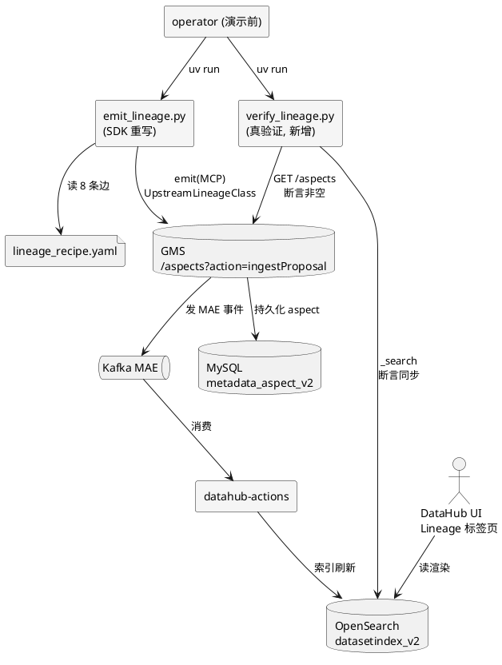

# Module 3 Data Lineage — Design

## Context

模块三要既「修对」又「教会」。修对的部分触碰 GMS 协议（已用 deepwiki 核实 v1.6 的硬要求）；教的部分必须遵循模块一/二确立的「教学 notebook 离线化」铁律（module1/module2 spec 明文禁止 notebook 调 GMS/OpenSearch）。两者必须严格分层。

**已核实事实**（deepwiki `datahub-project/datahub`）：
1. GMS v1.6 写 aspect 的正确路径是 `POST /aspects?action=ingestProposal`，body 包 `proposal` 外层，`aspect` 字段为 `{"value":"<json>","contentType":"application/json"}`
2. `Upstream` record 的 URN 字段名是 `dataset`（非 `upstreamEntity`）；`type` enum 为 `COPY`/`TRANSFORMED`/`VIEW`
3. `auditStamp` required 但有默认（`urn:li:corpuser:unknown` / time 0），缺省不致拒绝
4. 同项目 `scripts/emit_via_rest_emitter.py` 已用 `DatahubRestEmitter`+`MetadataChangeProposalWrapper`+`schema_classes` 成功注册 12 张表——证明 SDK 模式可用

**已核实事实**（本仓库代码）：
5. `lims.samples` 列：`SAMPLE_ID, MINE_CODE, MINE_NAME, SAMPLE_TYPE, ...`——**无 KUNNR**
6. `sap_erp.vbak` 列：`VBELN, ERDAT, ..., KUNNR, NETWR, ...`——**无 MINE_CODE**
7. 故 `lineage_recipe.yaml` 中 `vbak/vbap → lims.samples` 的 `join_key: KUNNR` 是**字面错误**：两表无任何共享列，跨系统真实关联（MINE_CODE）也不在 vbak
8. 3 张 DWA 表未被 `direct_es_bulk.py` 注册为 dataset，血缘边会指向悬空节点
9. `build_dwa_models.py` 真实派生：`dwa_sales_daily ← vbak`、`dwa_tag_alarm ← tags`、`dwa_coal_quality ← samples`（DWA 边有真 provenance，非 fabrication）

## Goals / Non-Goals

**Goals**：
- 血缘真正写入 GMS 并能在 UI Lineage 标签页看到（有真验证脚本背书）
- `emit_lineage.py` 用官方 SDK 模式，无 neo4j 死代码
- 8 条血缘边（5 修正 + 3 DWA）语义诚实
- 教学 notebook 离线、3 步节奏、含「业务影响」白话，符合 module1/2 spec 风格
- 诚实地把「跨系统产销全链（CHARG）= Phase 2 待解数据孤岛」作为教学结论，不 fabrication

**Non-Goals**：
- 不实现 OpenLineage 自动血缘采集（Phase 2 / 模块九）
- 不补 PI→LIMS（CHARG）→SAP→KNA1→OA 的 5 跳全链（源数据本无 CHARG 关联，属模块七主数据标准化范围）
- 不做列级血缘（`fineGrainedLineages`，留待办）
- 不改模块一/二 notebook
- 不改 `data/historical/` 源数据

## Decisions

### Decision 1: emit_lineage.py 改用官方 SDK，而非修补裸 requests

**选择**：参照 `emit_via_rest_emitter.py`，用 `DatahubRestEmitter` + `MetadataChangeProposalWrapper` + `schema_classes.UpstreamLineageClass` / `UpstreamClass`。

```python
from datahub.emitter.rest_emitter import DatahubRestEmitter
from datahub.emitter.mcp import MetadataChangeProposalWrapper
import datahub.metadata.schema_classes as schema

emitter = DatahubRestEmitter(gms_server="http://localhost:28080")
mcp = MetadataChangeProposalWrapper(
    entityUrn=downstream_urn,
    aspect=schema.UpstreamLineageClass(upstreams=[
        schema.UpstreamClass(dataset=upstream_urn, type="TRANSFORMED")
    ]),
)
emitter.emit(mcp)
```

**理由**：
- SDK 自动处理 `?action=ingestProposal` + `value/contentType` wrapping + 正确字段名 `dataset`，根除 4 处协议错误
- `emit_via_rest_emitter.py` 已证此模式可用（12 张表注册成功）
- `auditStamp` 由 SDK 填默认，无需手写
- 删 `import neo4j` 与 fallback，消除「声称移除实则残留」的矛盾

**备选**：
- ~~修补裸 requests 改成正确 4 字段~~ → 手写 `value/contentType` 字符串包装易错，且与项目既有 SDK 用法不一致
- ~~用 GraphQL~~ → 写 aspect 用 REST MCP，GraphQL 主要用于读

### Decision 2: lineage_recipe.yaml 的 join_key 语义诚实化

**选择**：`vbak/vbap → lims.samples` 边去掉 `join_key: KUNNR`，改 `type: business_lineage` + `description` 写明「声明式业务关系：客户订购的煤其质量曾在某矿井化验；两表无字面共享列，真实跨系统关联键 MINE_CODE 不在 vbak，此边表示业务语义而非可执行 JOIN」。加工血缘边保留 `type: processing_lineage`。

**理由**：
- `lims.samples` 无 KUNNR（已核实），`join_key: KUNNR` 是事实错误
- DataHub `Upstream` record 无原生 `join_key`/`type=business_lineage` 字段，这些都只是 recipe 自定义元数据，不影响写入——但 notebook 与文档必须如实说明，避免教错
- 诚实地把「字面不可 JOIN」本身作为「数据孤岛」教学点

**备选**：
- ~~改成 `join_key: MINE_CODE`~~ → vbak 无 MINE_CODE，仍错
- ~~删掉这两条业务血缘边只留加工血缘~~ → 失去模块三「跨系统血缘」核心卖点

### Decision 3: DWA 表先注册为 dataset，再加血缘边

**选择**：在 `emit_via_rest_emitter.py` 的 `ASSETS` 列表追加 3 张 DWA 表（platform=`dwa`），再在 recipe 加 3 条 `dwd.vbak → dwa_sales_daily` 等边。

**理由**：
- 血缘边目标 URN 必须先存在为 dataset，否则 UI 上是悬空节点
- DWA 表由 `build_dwa_models.py` 真实派生（已核实），边有 provenance
- platform 用 `dwa` 与现有 `dwd` 命名一致

**备选**：
- ~~DWA 边指向 `dwd.vbak` 等而非新 dataset~~ → 混淆 DWD/DWA 层语义

### Decision 4: 新增 verify_lineage.py 做真验证（aspect 断言）

**选择**：脚本对每条 recipe 边，`GET /aspects/<urn>?aspect=upstreamLineage` 断言返回的 `upstreams` 非空且包含预期上游 URN；再查 OpenSearch `datasetindex_v2` 确认索引同步。失败即非零退出。

**理由**：
- 当前全项目无 aspect 断言，是「声称能用未验证」的根因
- 演示前跑一次，确保 UI 一定有边
- `GET /aspects` 是只读 RestLi 端点（`urn` 需 URL 编码），无需鉴权写

**备选**：
- ~~只看 UI 截图~~ → 截图无法在 CI/脚本中断言，且 MAE→actions 延迟期会误判为失败

### Decision 5: 教学笔记本分层 —— 离线库 + 只读脚本，不直连服务

**选择**：notebook 不直连任何 GMS/OpenSearch 服务（无 `requests`/`datahub` SDK/端口号字面量）。两层供给：

1. **离线层** `src/dg_education/lineage.py`：`load_lineage_graph(recipe_path)` / `upstream` / `downstream` / `blast_radius` / `render_ascii`，数据源 `lineage_recipe.yaml` + `data/historical/` Parquet。notebook 直接 import 调用。
2. **联网层** `scripts/query_lineage.py`（只读）：查 GMS `upstreamLineage` aspect 输出 JSON。notebook 经 `subprocess` 调用它拿「DataHub 真图」，在步骤 2 与 recipe 自建图对比确认边一致。

UI 部分用 markdown 截图章节（同 module1「附加」节）。

**理由**：
- 沿用 module1/module2 既定分层：教学 notebook 不直连服务，联网操作归 scripts（module1 把联网塞进 `datahub_setup.ipynb`，本变更把血缘联网归 `query_lineage.py` 供 notebook 调）
- notebook 既能离线讲概念/算 blast-radius，又能通过脚本看到 DataHub 真图，教学价值不打折
- 写操作（`emit_lineage.py`）仍由 operator 在 notebook 外跑，notebook 只读不写
- blast-radius 用 DWA 层真聚合数据算（`dwa_coal_quality` 异常矿井 → `dwa_sales_daily` 同矿井销售），诚实且离线

**备选**：
- ~~notebook 直接调 GMS GraphQL/SDK 查血缘~~ → 违反「notebook 不直连服务」分层，且依赖服务在线、有延迟
- ~~notebook 纯离线只读 recipe~~ → 看不到 DataHub 真图，演示的是自建模而非真图，教学价值打折

### Decision 6: MAE→actions 延迟的演示处理

**选择**：`verify_lineage.py` 用轮询（最长 30s）等 OpenSearch 索引出现边；notebook markdown 节明确「写入后 UI 约 5-30s 出现（MAE→datahub-actions→OpenSearch，OS 默认 refresh 1s，瓶颈在 actions 消费）」。

**理由**：
- deepwiki 确认链路：GMS 写 → Kafka MAE → actions 消费 → OpenSearch 索引
- OpenSearch 默认 `refresh_interval=1s`（tavily 核实），但 actions 消费是可变瓶颈
- 演示 10 分钟内若卡延迟会翻车，轮询+说明双保险

## 架构图（PlantUML）

### 写入与验证链路



### 教学笔记本分层血缘图

```plantuml
@startuml
skinparam rectangleBackgroundColor #F5F5F5
notebook "module3.ipynb\n(不直连服务)" as nb
file "lineage_recipe.yaml" as recipe
file "data/historical/*.parquet" as parquet
rectangle "dg_education.lineage\n(新增, 离线层)" as lib
rectangle "dg_education.visualization\n(扩展)" as viz
rectangle "query_lineage.py\n(只读, 联网层)" as query
database "GMS\nGET /aspects" as gms

nb --> lib : import 调用\nload_lineage_graph/upstream/downstream/blast_radius
nb --> viz : plot_lineage_graph
lib --> recipe : 读图
nb --> parquet : pandas 读 DWA/源表\n算 blast-radius
nb --> query : subprocess 调用\n拿 DataHub 真图
query --> gms : GET upstreamLineage\n(输出 JSON)
nb --> nb : 对比 recipe 自建图 vs 真图
@enduml
```

## Risks / Trade-offs

| 风险 | 缓解 |
|------|------|
| `datahub` SDK 未在 pyproject.toml 声明（emit_via_rest_emitter 能跑说明已装，但未必声明） | tasks 先核实 `pyproject.toml`，缺则 `uv add` |
| `networkx` 未声明 | 同上，缺则 `uv add networkx` |
| GMS 写入返回 200 但 aspect 实际为空（重蹈覆辙） | `verify_lineage.py` 断言 aspect 非空，非零退出 |
| MAE→actions 延迟导致演示翻车 | verify 轮询 30s + notebook markdown 明示延迟 |
| DWA 表注册后 URN 与 `asset-metadata-ingestion` spec 的「12 张表」冲突 | 本变更 Modified Capabilities 显式扩为 15 张 |
| `join_key` 语义变更被误读为「血缘断了」 | recipe description + notebook + Module3.md 三处写明是声明式业务关系 |
| 裸 `POST /aspects` 当前是否真返回 200 未实测 | 不依赖其行为；重写后用 verify 实测 |

## Migration Plan

**一次性 commit，分 6 组**：
1. 核实/补依赖（pyproject.toml: datahub, networkx）
2. 重写 `emit_lineage.py`（SDK + 删 neo4j）
3. 修 `lineage_recipe.yaml`（join_key 诚实化 + 3 DWA 边）
4. 扩 `emit_via_rest_emitter.py` 注册 3 DWA 表 + 新增 `verify_lineage.py`
5. 新增 `src/dg_education/lineage.py` + 扩 `visualization.py` + `__init__.py`
6. 新增 `notebook/module3.ipynb` + 更新 `docs/Module3.md`

**验证**：
- `uv run python scripts/emit_lineage.py` 写入 8 条边
- `uv run python scripts/verify_lineage.py` 全部断言通过
- `uv run jupyter notebook notebook/module3.ipynb` 全 cell 跑通无 error
- DataHub UI Lineage 标签页看到边（人工）

**回滚**：`git revert`；GMS 侧用 verify 的 `--purge`（如实现）清理

## Open Questions

无。所有关键决策（SDK 模式、join_key 诚实化、DWA 注册、离线 notebook、延迟处理）已基于 deepwiki + 代码核实与用户对齐（scope A，5+3 边）。
