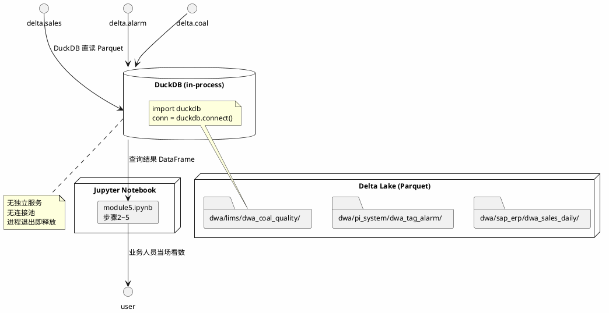

# 模块六：DWA 宽表即席查询验证 — 技术设计

## Context

### 背景

模块五已通过 `scripts/build_dwa_models.py` 产出 3 张 DWA 宽表并写入 Delta Lake：

- `data/lakehouse/dwa/sap_erp/dwa_sales_daily/`
- `data/lakehouse/dwa/pi_system/dwa_tag_alarm/`
- `data/lakehouse/dwa/lims/dwa_coal_quality/`

模块六的目标是：验证业务人员能用 DuckDB 对这 3 张表做即席查询，当场出数。

### 约束

- 教学数据规模约 1GB Parquet，内存可完全加载
- 业务人员没有独立 OLAP 集群，零运维成本
- notebook cell 代码 ≤15 行，不内联大段 SQL

## Goals / Non-Goals

**Goals:**
- 业务人员打开 `notebook/module5.ipynb` 能跑通步骤 2~5，看到即席查询结果
- 4 个分析场景（销售趋势 / 告警排名 / 月度煤质 / 产销对比）当场可验证
- `docs/Module6.md` 提供 SQL 模板和 CLI 命令，业务人员可直接复制使用

**Non-Goals:**
- 不引入 ClickHouse / Doris 等独立 OLAP 引擎（Phase 2 再升级）
- 不实现 DataHub 即席查询（DataHub 是元数据平台，不是查询引擎）
- 不修改 `scripts/build_dwa_models.py` 的聚合逻辑
- 不建生产级看板（Superset 等 Phase 2 再引入）

## Decisions

### Decision 1：DuckDB 而非 ClickHouse 作为即席查询引擎

**选择**：DuckDB（in-process，零运维）

**理由**：
- 单节点 <100GB 规模下，DuckDB 性能优于 ClickHouse（[ClickBench 2025年10月排名第一](https://motherduck.com/learn/fastest-olap-databases-compared)）
- 嵌入式（in-process），无需启动服务，Jupyter notebook 内直接 `import duckdb` 使用
- 直接扫描 Parquet / Delta Lake 文件，无需数据导入
- 教学数据约 1GB，完全在 DuckDB 舒适区

**备选**：
- ClickHouse：分布式，适合 TB 级数据，但需要独立服务，不适合教学场景
- Doris：兼容 MySQL 协议，但部署复杂，教学环境不必要的开销

### Decision 2：复用 `build_dwa_models.py` 中的 DuckDB 连接，不新建连接封装

**选择**：在 notebook 中直接用 `duckdb.connect()` 创建连接

**理由**：
- 模块五的 `get_duckdb()` 注册了 ODS/DWD 层，本模块的 DWA 层可以直接用路径读取
- 即席查询每次都是新连接（in-memory），无需复用连接池

### Decision 3：SQL 模板放在 `docs/Module6.md` 中，不放在代码库

**选择**：文档提供 SQL 示例，代码只做展示

**理由**：
- SQL 模板是给业务人员参考的，用完即弃，不应污染代码库
- 文档可随业务需求迭代修改，无需走代码变更流程

### Decision 4：notebook 中每个即席查询 cell ≤15 行

**选择**：只在 cell 中调用 `duckdb.execute().df()` 并打印结果

**理由**：
- cell 是「展示层」，聚合逻辑已在 `build_dwa_models.py` 中定义
- 15 行限制确保 cell 可读，业务人员不会看到冗长的 SQL

## 架构图



## 4 个分析场景的 SQL 模板

### 场景 1：销售趋势（日销售汇总）

```sql
SELECT
    sale_date,
    order_count,
    customer_count,
    total_amount,
    avg_order_amount
FROM 'data/lakehouse/dwa/sap_erp/dwa_sales_daily/'
ORDER BY sale_date DESC
LIMIT 30;
```

### 场景 2：告警传感器排名

```sql
SELECT
    mine,
    face,
    tag,
    high_value_count,
    avg_value,
    stddev_value
FROM 'data/lakehouse/dwa/pi_system/dwa_tag_alarm/'
ORDER BY high_value_count DESC
LIMIT 20;
```

### 场景 3：月度煤质

```sql
SELECT
    MINE_CODE,
    month,
    SAMPLE_TYPE,
    sample_count,
    avg_ash_content,
    avg_gross_calorific
FROM 'data/lakehouse/dwa/lims/dwa_coal_quality/'
ORDER BY month DESC, MINE_CODE
LIMIT 50;
```

### 场景 4：产销对比（⚠️ 需业务自己写 JOIN）

```sql
-- 注意：当前 3 张 DWA 表均为单系统汇总，
-- 跨系统产销对比需要 JOIN dwa_sales_daily（SAP）
-- 和 PI 生产数据，Phase 2 的 dwa_sales_production 交付后自动解决。
SELECT
    s.sale_date,
    s.total_amount,
    p.mine,
    p.alarm_count
FROM 'data/lakehouse/dwa/sap_erp/dwa_sales_daily/' s
-- LEFT JOIN ...  -- 需补充 PI 生产数据路径
LIMIT 30;
```

## Risks / Trade-offs

| 风险 | 描述 | 缓解措施 |
|------|------|---------|
| R1 | 业务人员不熟悉 SQL，复制模板后报错 | 在 `docs/Module6.md` 中提供「报错自查清单」 |
| R2 | DuckDB 内存不足（机器 <8GB） | 教学中限制 Parquet 读取量；文档中说明内存要求 |
| R3 | DWA 表路径变更后 SQL 失效 | 路径统一用常量；在 `docs/Module6.md` 中标注「如路径变更，同步更新」 |
| R4 | 产销对比场景给业务人员造成「已经能做」的误解 | 在步骤5 cell 和文档中明确标注诚实声明：当前为单系统宽表 |

## Open Questions

- Q1：DWA 表路径是否在 Phase 2 变化？（跨系统产销宽表可能引入新目录结构）
  - 答案：预计不变，Phase 2 在 `dwa/` 下新增子目录，不影响现有 3 张表
- Q2：是否需要提供 JupyterLab 以外的查询入口（如 VS Code Jupyter 插件）？
  - 答案：暂不需要，文档中已提供 DuckDB CLI 命令作为替代方案
