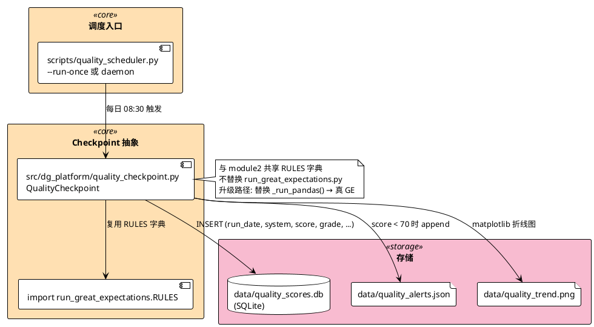
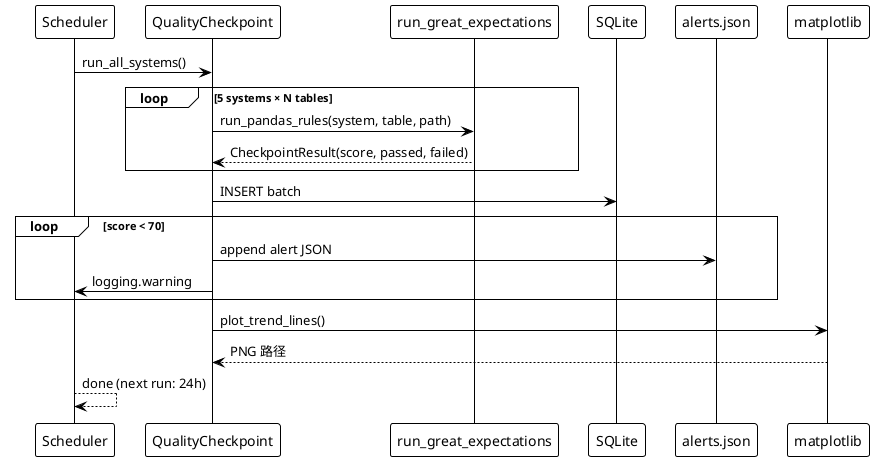

## Context

模块 2 演示版质量检测：`scripts/run_great_expectations.py` 用 pandas 模拟 GE 规则，CLI 输出 + 单次 JSON 报告。Background.md §6.10 目标：定时调度 + 持久化历史 + 阈值告警。

**当前状态（module2）**：
- `run_great_expectations.py`：~250 行 pandas 模拟引擎，rule set 字典 `RULES` 定义 5 系统 × N 张表的规则
- `data/quality_report_2022.json`：单次报告样例
- 手动 CLI 调用：`uv run python scripts/run_great_expectations.py --system all`

**约束**：
- 10 分钟 demo 时长（启 Airflow 5 分钟+ 跑 1 分钟 = 不够用）
- 5 系统 × 1 年 1800 行历史 → ClickHouse 过重
- 邮件/MinIO/Slack 引入外部服务 → demo 阶段不必要
- 现有 `run_great_expectations.py` 是 rule set 唯一来源，不应替换

**利益相关者**：教学讲师（演示）、学员（学习曲线）、运维（生产维护）。

## Goals / Non-Goals

**Goals:**
1. Checkpoint 抽象包装 pandas 规则，输出结构化 `CheckpointResult`
2. APScheduler 守护模式 + `--run-once` CLI 模式
3. SQLite 持久化每日分数（1800 行/年）
4. 阈值告警（score < 70 写 alerts.json + console warning）
5. matplotlib 趋势图（5 系统折线，X 轴日期）
6. 4-cell teaching notebook 演示完整闭环

**Non-Goals:**
- 真 Great Expectations 库接入（演进路径写入 design 但不实现）
- Airflow standalone / Kubernetes 部署（demo 阶段不需要）
- ClickHouse / 时序专用库（SQLite 够用）
- 邮件 / Slack 通知（写 alerts.json + console 模拟）
- 分布式多 worker 调度（APScheduler 单进程够 demo）

## Decisions

### Decision 1: APScheduler 替代 Airflow（不引 Docker 容器）

**选择**：`apscheduler>=3.10` Python 库，`BlockingScheduler` + `CronTrigger(hour=8, minute=30)`。

**备选**：
- A. Airflow standalone（3 service Docker Compose，5 分钟启动）
- B. APScheduler（**选择**）：0 Docker，30 秒启动
- C. Linux cron：最简但无 Python 集成

**理由**：
- demo 10 分钟内能跑通
- 与 ETL 脚本同进程调用，无跨语言粘合
- 升级到生产：把 `job()` 函数包成 Airflow `PythonOperator` 即可（同一份 Python）

### Decision 2: SQLite 替代 ClickHouse

**选择**：`data/quality_scores.db` 单表，pandas `read_sql` 查。

**备选**：
- A. ClickHouse（Docker，1 schema，1800 行→ 100MB 容器）
- B. JSON Lines 文件（解析麻烦，趋势图要重读）
- C. SQLite（**选择**）：单文件 ~10KB，pandas 原生

**理由**：1800 行/年 量级用 ClickHouse 是杀鸡用牛刀；SQLite 在 demo 阶段不引入外部依赖，运维/学员本地无脑跑通。

### Decision 3: QualityCheckpoint 抽象（不引真 GE 库）

**选择**：`src/dg_platform/quality_checkpoint.py` 类接收 `RULES` 字典 + data path，复用 `run_great_expectations.py` 的 `expect_*` 函数。

**备选**：
- A. 真 `great_expectations` 库（需 ephemeral context + suite 注册）
- B. 包装 pandas 规则（**选择**）：保留 demo 友好的轻量级规则

**理由**：
- 现有 pandas 规则已覆盖 5 系统核心场景
- 引真 GE 库需要从 `RULES` 字典转为 `ExpectationSuite` 字典，规则语义差异（`expect_column_values_to_be_unique` 支持 tuple 列组合 vs GE `composite-unique-key`）需重新映射
- Checkpoint 抽象预留接口，未来切真 GE 只需替换 `_run_pandas()` 方法

### Decision 4: 阈值告警 — console + JSON 文件

**选择**：score < 70 时 `logging.warning` 输出 + 追加到 `data/quality_alerts.json`（JSON 数组）。

**备选**：
- A. 邮件（需要 SMTP 配置）
- B. Slack Webhook（需要 webhook URL）
- C. console + JSON 文件（**选择**）：0 外部依赖

**理由**：demo 阶段让学员看到"如果分数低会怎样"，JSON 文件可被 Superset / DataHub 后续消费。

### Decision 5: 趋势图 — matplotlib 单图（不引可视化库）

**选择**：`matplotlib.pyplot.plot` 渲染 5 系统折线图 → `data/quality_trend.png`。

**理由**：matplotlib 已在依赖中；趋势图用于教学 + 演示 + 存档，不需要交互式图表。

### Architecture Diagram

### Data Flow: 一次调度执行

## Risks / Trade-offs

| 风险 | 影响 | 缓解措施 |
|------|------|----------|
| APScheduler 单进程崩溃 | 调度停止 | demo 阶段可接受；生产换 Airflow |
| SQLite 单文件无备份 | 容器销毁数据丢 | 1800 行/年可重建；`data/quality_scores.db` 在 .gitignore 不提交 |
| matplotlib 中文字体缺失 | 折线图标签方块化 | 设置 `plt.rcParams['font.sans-serif'] = ['Noto Sans CJK SC']` |
| `--run-once` 与 daemon 模式冲突 | CLI 重入 | 检查 `scheduler.running` flag，daemon 已启动时报错退出 |
| `run_great_expectations.RULES` import 失败 | checkpoint 全部跑挂 | try/except 包装每个 system，单个失败不阻断其他 |
| 阈值 70 硬编码 | 不同系统可能需不同阈值 | 预留 `CHECKPOINT_THRESHOLD` env var override |
| 趋势图在 0 行历史时崩溃 | 首次运行 | 空 DataFrame 跳过 plot，输出占位提示 |

## Migration Plan

**部署顺序**：
1. `pyproject.toml` 加 `apscheduler>=3.10`，`uv sync` 验证
2. 新建 `src/dg_platform/quality_checkpoint.py`
3. 新建 `scripts/quality_scheduler.py`
4. 跑 `uv run python scripts/quality_scheduler.py --run-once` 验证单次执行
5. 新建 `notebook/module10.ipynb`
6. 跑 daemon 模式 1 分钟（验证 APScheduler 不报错），`Ctrl+C` 退出
7. 新建 `docs/Module10.md`
8. 改 `docs/Background.md §6.10` + `README.md`
9. `openspec verify` + `openspec archive`

**回滚**（≤ 15 分钟）：
1. `rm src/dg_platform/quality_checkpoint.py scripts/quality_scheduler.py notebook/module10.ipynb`
2. `rm data/quality_scores.db data/quality_alerts.json data/quality_trend.png`（如有）
3. `uv remove apscheduler`
4. 现有 `run_great_expectations.py` 完全不受影响

## Open Questions

- APScheduler `apscheduler.jobstores.sqlalchemy` 与 SQLite 复用同一个 DB 文件，是否会让 schema 冲突？建议用独立 DB。
- 趋势图是否需要支持 Y 轴自动缩放到 `[score_min - 5, 100]`？目前用默认 `0-100`。
- 6.10 是否要触发 DataHub `dataProcessInstance` 事件（类似 6.9 lineage 路径）？建议不增加，6.10 聚焦"调度 + 告警"两件事。

## Evolution Path（不实现，仅记录）

Phase 3 升级为真 Great Expectations：
1. `pyproject.toml` 加 `great-expectations>=1.0`
2. 替换 `QualityCheckpoint._run_pandas()` → `gx.get_context().checkpoints.add(Checkpoint(...))`
3. 规则从 `RULES` 字典转为 `ExpectationSuite` YAML
4. APScheduler → Airflow `GXValidateCheckpointOperator`
5. 阈值告警 → Slack/Email operator
6. SQLite → ClickHouse time-series
