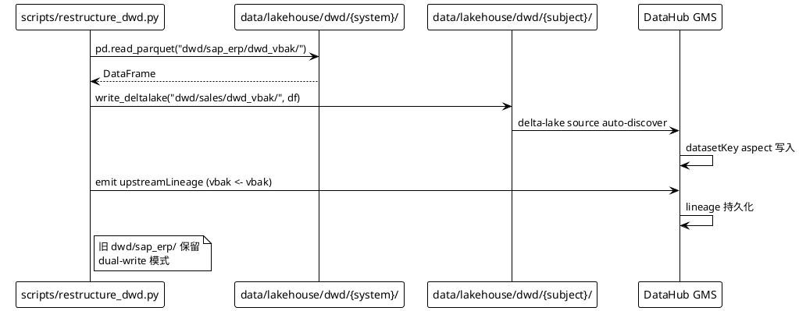

## Context

当前 `data/lakehouse/dwd/` 按源系统分区：`sap_erp/`、`pi_system/`、`lims/`、`oa/`、加上共享 `_dimensions/`。6.11 目标：按业务主题重组 DWD 表，让同主题跨系统数据自然落在同目录下。

**当前状态**：
- 5 个主题域 DWD 表：`dwd/sap_erp/dwd_vbak/`、`dwd/sap_erp/dwd_vbap/`、`dwd/sap_erp/dwd_kna1/`、`dwd/pi_system/dwd_tags/`、`dwd/lims/dwd_samples/`、`dwd/oa/dwd_doc_flow/`
- 3 个 dim 表：`dwd/_dimensions/dim_mine/`、`dwd/_dimensions/dim_customer/`、`dwd/_dimensions/dim_material/`
- 6.7 维表（dim_mine/customer/material）已完成
- 6.9 自动血缘已上线（LineageEmitter）

**约束**：
- 10 分钟 demo 时长
- 不重写现有 DWA 宽表（`dwa_*` 仍读 `dwd/{system}/*`）；6.12 再统一
- 维度表全局共享，**不**进 subject 目录
- 旧 `dwd/{system}/` 保留（dual-write 模式）

**利益相关者**：教学讲师（演示）、学员（学习曲线）、运维（生产维护）、DataHub UI 用户（树形浏览）。

## Goals / Non-Goals

**Goals:**
1. 4 个主题目录重组（sales/production/coal_quality/finance）
2. dual-write 保留旧 system-分区
3. DataHub 自动发现新主题目录（delta-lake source）
4. 重新 emit 新主题表的 lineage
5. notebook 演示新旧对比 + DataHub 视图

**Non-Goals:**
- 跨主题 JOIN（6.12 范围）
- DWA 宽表改读新主题（6.12 范围）
- 重命名 DWD 表（保留原名 `dwd_vbak` 等；只换目录）
- OLAP 物化视图（6.12 范围）

## Decisions

### Decision 1: Alibaba MaxCompute 命名规范

**选择**：用 `dwd_{domain}_{process}_{partition_type}` 规范，简化命名（去掉 `system_` 前缀）。

**备选**：
- A. 保留原名 `dwd_vbak`（**选择**）：目录重组但表名不变，下游 DWA 不需要改
- B. 改名 `dwd_sales_vbak_di`（MaxCompute 风格）：更标准但要改所有引用
- C. 改名 `sales_vbak`（去掉 `dwd_` 前缀）：更简洁但与 `dwd_tags` 等冲突

**理由**：演示阶段保留原名，6.12 跨主题 JOIN 时再统一改名。

### Decision 2: dual-write 模式（保留旧 + 新）

**选择**：脚本 `restructure_dwd.py` 既写新主题目录，**也**保留旧 system-分区不变。

**备选**：
- A. 硬替换（删除旧、只留新）
- B. dual-write（**选择**）：演示阶段零风险，学员能对比新旧
- C. Symlink 软链：Linux 软链跨目录，但 Delta Lake schema 校验可能失败

**理由**：演示场景下存储成本可忽略；教学价值更高（同一查询在新旧两种布局下都能跑）。

### Decision 3: DataHub `delta-lake` source 自动发现

**选择**：用 DataHub `delta-lake` source 配 `base_path: data/lakehouse/dwd`，递归扫描所有 Delta Lake 表。

**备选**：
- A. `delta-lake` source 自动扫描（**选择**）：删一行 YAML 即可
- B. `s3` source with `path_specs` 模式：更灵活但要写正则
- C. 自定义 emit 脚本：完全控制但开发量

**理由**：
- `delta-lake` source 官方支持，配置最简
- 自动发现新主题目录，6.12 加新表无需改配置
- OpenSearch 索引会反映新表（`datasetindex_v2`）

### Decision 4: 注册 `dwd` 自定义 platform

**选择**：用 `acryl-datahub` SDK 注册 `dwd` 作为自定义 platform，subject 维度用 `customProperties` 标注。

**备选**：
- A. 用 `file` platform（**不选**）：无业务语义
- B. 用 `dwd` 自定义 platform（**选择**）：DataHub UI 显示树形 `dwd > sales > dwd_vbak`
- C. 用 `delta-lake` platform：与存储引擎耦合，未来换存储麻烦

**理由**：DataHub UI 树形浏览对教学友好；`dwd` 是行业通用缩写。

### Decision 5: dimension tables 保留在 `_dimensions/`

**选择**：`dim_mine`/`dim_customer`/`dim_material` **不**进 subject 目录，保留 `dwd/_dimensions/`。

**备选**：
- A. dim 跟随业务域（dim_mine 进 `dwd/coal_quality/`）：按域划分
- B. dim 全局共享（**选择**）：`_dimensions/` 一处管理

**理由**：维度是跨域共享的（如 `dim_mine` 被 `production`/`coal_quality`/`sales` 共同引用），分到 subject 会导致跨域引用。

### Architecture Diagram

```plantuml
@startuml
!theme plain

rectangle "新 DWD layout" {
  (dwd) {
    (_dimensions) {
      [dim_mine]
      [dim_customer]
      [dim_material]
    }
    (sales) {
      [dwd_vbak]   <- SAP
      [dwd_vbap]   <- SAP
      [dwd_kna1]   <- SAP
    }
    (production) {
      [dwd_tags]   <- PI
    }
    (coal_quality) {
      [dwd_samples]  <- LIMS
    }
    (finance) {
      [dwd_doc_flow] <- OA
    }
  }
}

rectangle "旧 DWD layout (保留)" {
  (sap_erp) {
    [dwd_vbak]
    [dwd_vbap]
    [dwd_kna1]
  }
  (pi_system) {
    [dwd_tags]
  }
  (lims) {
    [dwd_samples]
  }
  (oa) {
    [dwd_doc_flow]
  }
}

@enduml
```

### Data Flow: restructure_dwd.py dual-write



## Risks / Trade-offs

| 风险 | 影响 | 缓解措施 |
|------|------|----------|
| dual-write 存储 2× | 1GB → 2GB | demo 可接受；生产切流后清理旧目录 |
| DataHub datasetKey 重复（同名表新旧两个 URN） | DataHub UI 看到双份 | 用 `subject` 字段标注；或旧表用 `system_` 前缀 |
| Delta Lake `dwd/sap_erp/dwd_vbak` 与 `dwd/sales/dwd_vbak` schema 不一致 | 写入失败 | 复用同一份 df.copy()，schema 保证一致 |
| delta-lake source 配置改动需要重启 GMS | 短暂不可用 | 1 次性配好；6.12 增量不需要再改 |
| `_dimensions` 路径与 `dwd/sales/` 平级 | 学员误解 | Module11.md 明确说明 |

## Migration Plan

**部署顺序**：
1. 写 `scripts/restructure_dwd.py` 脚本（含 dry-run 模式）
2. dry-run 验证 4 主题目录会正确创建
3. 实际跑脚本生成 dual-write
4. 验证 4 主题目录都有数据（旧目录也存在）
5. 注册 `dwd` platform + emit 6 张新表的 datasetKey
6. 配置 DataHub `delta-lake` source 扫描 `dwd` 目录（**可选**，因为 `dwd` platform 走的是直接 emit）
7. 创建 `notebook/module11.ipynb`
8. 创建 `docs/Module11.md`
9. `openspec verify` + `openspec archive`

**回滚**（≤ 30 分钟）：
1. `rm -rf data/lakehouse/dwd/{sales,production,coal_quality,finance}`
2. `rm scripts/restructure_dwd.py notebook/module11.ipynb`
3. `datahub delete --urn ...` 6 张新表
4. 旧 system-分区完全不动

## Open Questions

- `delta-lake` source 是否会让 DataHub OpenSearch 索引重复条目？需要验证 dual-write 的两个同名 dataset 能否共存。
- 主题目录是否需要 `OWNER` 字段（DataHub customProperties 标注 Owner 是 销售部/生产部/煤质中心）？
- 6.11 是否要 emit `dataJob` 实体表示 "restructure_dwd.py 自身" 的 ETL 任务？建议不增加。
