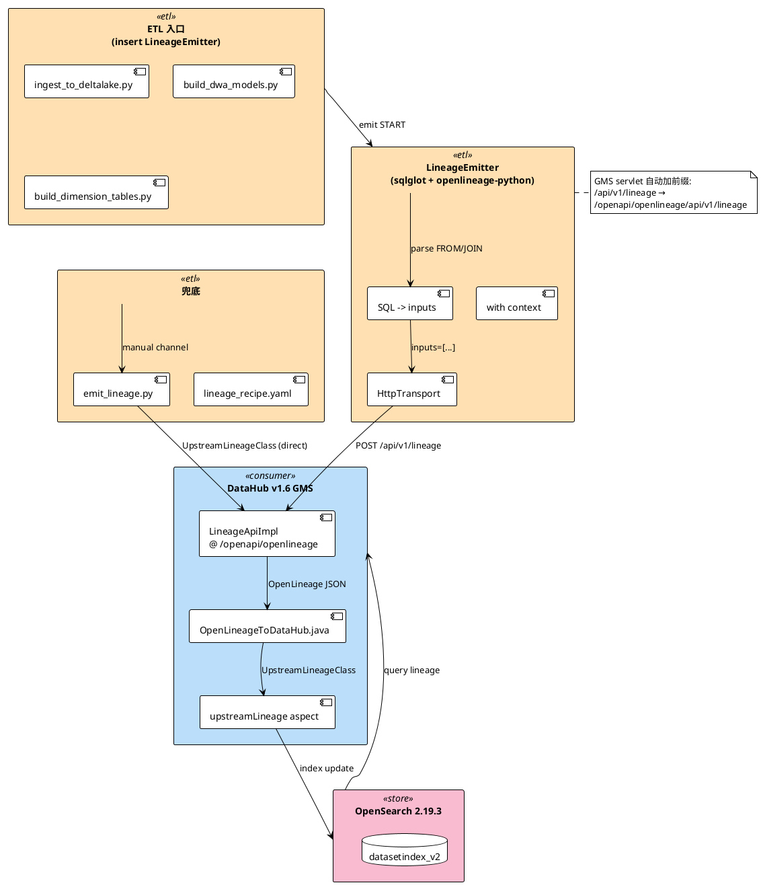
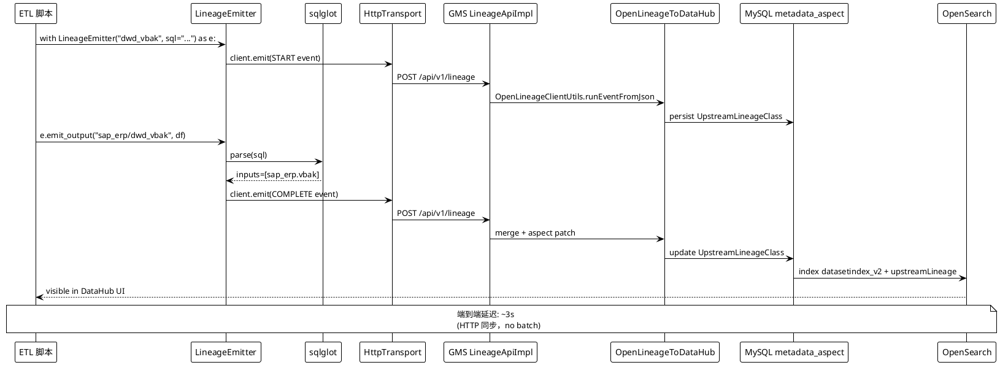

## Context

模块 3 演示版血缘通过 `scripts/emit_lineage.py` + `lineage_recipe.yaml` 维护 8 条手工边（5 系统 × N 主题域规模下不可扩展）。6.9 目标是从 ETL 任务**自动**采集血缘：业务代码改动 ≤ 5 行；新增 DWD/DWA 表零配置即出现血缘；保留手工通道作为跨系统业务 JOIN 兜底。

**当前状态（module3）**：
- 6 个 ETL 入口函数：
  - `ingest_to_deltalake.py`: `ingest_ods()` / `ingest_dwd()` / `ingest_dwa()`
  - `build_dwa_models.py`: `build_dwa_sales_daily()` / `build_dwa_tag_alarm()` / `build_dwa_coal_quality()` / `build_dwd_with_derived()`
  - `build_dimension_tables.py`: `build_dim_mine()` / `build_dim_customer()` / `build_dim_material()`
- `lineage_recipe.yaml` 8 条边手工维护
- DataHub v1.6.0 + GMS REST + OpenSearch 2.19.3 + Kafka 8.0 + Actions 服务

**约束**：
- 业务代码改动 ≤ 5 行/ETL 入口
- 演示时长 10 分钟内：ETL 跑完 → 血缘 30 秒内出现在 DataHub UI
- 业务跨系统 JOIN（如 `sap_erp.vbak → lims.samples` 按 KUNNR）SQL 解析不友好，必须保留手工通道

**利益相关者**：教学讲师（演示）、学员（学习曲线）、运维（生产维护）、DataHub UI 用户（图谱消费）。

## Goals / Non-Goals

**Goals:**
1. ETL 任务从 SQL 解析自动推导 `inputs` / `outputs`，零 YAML 维护
2. emit OpenLineage 1.x 事件，HTTP 直发到 GMS REST 端点
3. GMS 内部 `OpenLineageToDataHub` 转换器自动写 `upstreamLineage` aspect
4. 业务代码改动 ≤ 5 行/ETL 入口
5. 端到端延迟 ≤ 30 秒（ETL 完成 → DataHub UI 出现新边）
6. module9 notebook 演示 auto + manual 双通道视觉对比

**Non-Goals:**
- Spark/Flink 原生 OpenLineage 集成（生产阶段再上）
- Kafka transport（HTTP 更简单，无运维成本）
- 替换模块 3 教学 notebook（保留作 fallback 演示）
- Phase 3 血缘覆盖率 SLA 评分卡（Idea 7，移出本次范围）
- 业务跨系统 JOIN 自动发现（保留手工 YAML 兜底）

## Decisions

### Decision 1: OpenLineage Python SDK（不用自研 emitter）

**选择**：`openlineage-python>=1.0` 官方 SDK，提供 `OpenLineageClient` + `LineageEvent` + `HttpTransport` 标准结构。

**备选**：
- A. 自研 emitter：完全可控但失去标准兼容
- B. Marquez Python SDK：Marquez 单一后端绑定
- C. OpenLineage SDK（**选择**）：LinkedIn/IBM/Airflow 共同维护；DataHub v1.6.0 GMS 原生消费

**理由**（证据来源：acryldata/datahub v1.6.0 + openlineage-python 1.51.0 PyPI）：
- GMS 内部 `io.openlineage.client.OpenLineageClientUtils.runEventFromJson` 直接解析 OpenLineage 1.x JSON
- HTTP transport 内置于 `openlineage-python` 基础包（仅依赖 `httpx`），无需 `[kafka]` 等额外 extras
- 事件 schema 标准化，跨工具（Airflow / Spark / dbt）通用

### Decision 2: SQL 解析用 sqlglot（不用 sqltap / sqlparse）

**选择**：`sqlglot>=20.0` Python 库，支持 20+ 方言（DuckDB、Spark、Hive、PostgreSQL）。

**备选**：
- A. `sqlparse`：lexer 级，无法识别子查询 / JOIN ON 条件
- B. `sqltap`：项目已不维护
- C. `sqlglot`（**选择**）：生产级解析器，错误恢复策略明确，UPSERT/CTE 友好

**理由**（证据来源：sqlglot GitHub `expressions/builders.py`）：
- `find_all(exp.Table)` 返回 `exp.Table` 对象，可通过 `exp.table_name(table)` 获取限定名（如 `sap_erp.vbak`）
- CTE 过滤：`scope.cte_sources` 在 sqlglot 内部用于排除 CTE 引用
- 错误处理：`from sqlglot import ParseError` 顶层导入，解析失败可捕获并降级
- 本项目 ETL 用 DuckDB 内嵌 SQL（`build_dwa_models.py`），sqlglot 对 DuckDB 方言支持好

### Decision 3: 上下文管理器模式（非装饰器 / 回调）

**选择**：Python `with` 上下文管理器 `LineageEmitter("job_name")` 自动 emit START/COMPLETE/FAIL 事件。

**备选**：
- A. 装饰器 `@with_lineage`：侵入性强，难跨函数聚合
- B. 回调函数 `emitter.on_complete()`：易遗漏
- C. 上下文管理器（**选择**）：自然的事务边界，与 ETL 任务"开始-结束"语义 1-1 映射

**业务代码示意**（每个 ETL 入口 ≤ 5 行）：
```python
def ingest_dwd():
    with LineageEmitter("dwd_vbak", sql=SQL_DWD_VBAK) as e:
        df = clean_basic(read_parquet_with_partitions(SRC))
        write_delta("sap_erp/dwd_vbak", df, partition_by=["year"])
        e.emit_output("sap_erp/dwd_vbak", df)
```

### Decision 4: HTTP 直发到 GMS REST 端点

**选择**：`LineageEmitter` 用 `openlineage-python` 的 `HttpConfig(url="http://localhost:28080", endpoint="/api/v1/lineage")` 直接 HTTP POST 到 GMS。

**备选**：
- A. Kafka + 自建 consumer：需要独立 Python 服务读 topic + 转发 HTTP
- B. HTTP 直发（**选择**）：DataHub v1.6.0 官方支持，0 额外组件

**理由**（证据来源：bg_fcd0013c + bg_fba9e53c + bg_d877b68c + 本机探活）：
- GMS 端点 `POST /openapi/openlineage/api/v1/lineage` 实测可达（GMS 容器日志 `io.datahubproject.openapi.openlineage.controller.LineageApiImpl.postRunEventRaw` 已记录事件处理）
- `datahub-actions` **没有**内建的 OpenLineage consumer action（kafka source 只懂 DataHub 内部 Avro 格式）
- HTTP 路径延迟 < 1s，路径 `/api/v1/lineage` 由 GMS servlet context `/openapi/openlineage/` 自动前缀处理
- 端点**默认启用**，无需 `DATAHUB_OPENLINEAGE_ENABLED` 开关

**URL 关键细节**（`HttpConfig` 的 `url` + `endpoint` 是分离参数）：
- `url = "http://localhost:28080"`（仅 base，无 trailing slash）
- `endpoint = "/api/v1/lineage"`（OpenLineage API 路径）
- 完整 POST URL = `http://localhost:28080/openapi/openlineage/api/v1/lineage`（servlet 自动加 `/openapi/openlineage/` 前缀）

**GMS 容器需追加 1 行 env**（`datahub-datahub-gms-quickstart-1` service）：
- `DATAHUB_OPENLINEAGE_ENV: PROD`（fabric type，匹配现有 dataset URN 后缀）

其余 9 个 `DATAHUB_OPENLINEAGE_*` env vars 全部用默认值（`MATERIALIZE_DATASET=true`、`CAPTURE_COLUMN_LEVEL_LINEAGE=true` 等），无需配置。

### Decision 5: 兜底通道保留 lineage_recipe.yaml

**选择**：业务跨系统 JOIN（如 `sap_erp.vbak → lims.samples` 按 KUNNR 关联）走 `lineage_recipe.yaml` 手工通道，与 auto 通道并存。

**理由**：SQL 解析对"按业务键关联"语义不友好（如 `vbak.KUNNR = lims.samples.MINE_CODE`）；手工 YAML 明确说明为"声明式业务关系"（data-lineage-ingestion 现有 requirement 已规范）。

### Architecture Diagram



### Data Flow: 一次 ETL 跑完的完整时序



## Risks / Trade-offs

| 风险 | 影响 | 缓解措施 |
|------|------|----------|
| sqlglot 解析 SQL 失败（非标准方言） | inputs 列表为空 | emit 时 `inputs=[]` 不阻断；事件仍上报，可手工补 |
| ETL 任务 emit 失败（GMS 短暂不可用） | 血缘缺失 | `HttpTransport` 内置 retry（`retry={"total": 5, "status_forcelist": [500,502,503,504]}`） |
| GMS 重启期间 emit | 血缘缺失 | 抛出异常让 ETL 任务感知；下次重跑自动补 |
| 业务代码改动 > 5 行/ETL 入口 | 演示价值降低 | 上下文管理器接口简化到 3 个方法：`emit_output` / `from_sql` / `run` |
| 兜底 YAML 与 auto 通道产生重复边 | DataHub UI 显示重复 | GMS OpenSearch 索引按 `dataset + upstream` URN 唯一键去重；`verify_auto_lineage.py` 启动时检测并报告 |
| `lineage_recipe.yaml` 路径依赖被破坏 | module3 演示失败 | 6.9 spec 明确"auto 与 manual 边共存"；module3 验证脚本不变 |
| OpenLineage Python SDK `runId` 必须是 UUID 36 字符 | 事件被 GMS 拒绝 | SDK 默认 `uuid.uuid4()` 生成正确格式；CI smoke test 验证 |
| GMS OpenLineage 默认开但用户不知情 | 安全风险 | 文档说明；生产环境应配 `DATAHUB_OPENLINEAGE_USE_PATCH=true` + auth |

## Migration Plan

**部署顺序**：
1. 改 `datahub-quickstart.yml` 在 `datahub-gms-quickstart.environment` 加 `DATAHUB_OPENLINEAGE_ENV: PROD`
2. 改 `pyproject.toml` dependencies 加 `openlineage-python>=1.0` + `sqlglot>=20.0`
3. `uv sync` 验证
4. 重启 GMS：`docker compose -f datahub-quickstart.yml restart datahub-gms-quickstart`
5. 部署 `LineageEmitter` 模块到 `src/dg_platform/lineage_emitter.py`
6. 灰度：先在 `ingest_to_deltalake.py` 启用（3 个函数）
7. 全量：扩展到 `build_dwa_models.py`（4 个函数）+ `build_dimension_tables.py`（3 个函数）
8. 创建 `scripts/verify_auto_lineage.py` 验证脚本
9. 创建 `notebook/module9.ipynb` 演示 + Playwright 截图
10. 更新 `docs/Module3.md` + `docs/Background.md` 第 6.3 节
11. 更新 `README.md` path B notebook 列表（**注意：影响学习路线**）
12. `openspec verify` + `openspec archive`

**回滚**（≤ 30 分钟）：
1. 从 3 个 ETL 文件删除 `with LineageEmitter(...)` 上下文（每个 ≤ 5 行删除）
2. `uv remove openlineage-python sqlglot` 减依赖
3. GMS env 变量删除（重启 GMS 容器）
4. `lineage_recipe.yaml` 通道完全不受影响

## Open Questions

- OpenLineage events 中 `inputs[].namespace` 是 `"sap_erp"` 还是完整 URN 字符串？需实际 emit 后看 GMS 端如何映射 dataset
- 列级血缘（`DATAHUB_OPENLINEAGE_CAPTURE_COLUMN_LEVEL_LINEAGE=true` 默认值）需在 events 中显式提供 `columnLineage` facet，本项目 6.9 是否要 demo？建议延后到 6.10+ 再深入
- module9 notebook 演示所需的 `DataHub UI 血缘截图` Playwright 脚本是否需要新写（与 module3 区别开）？
