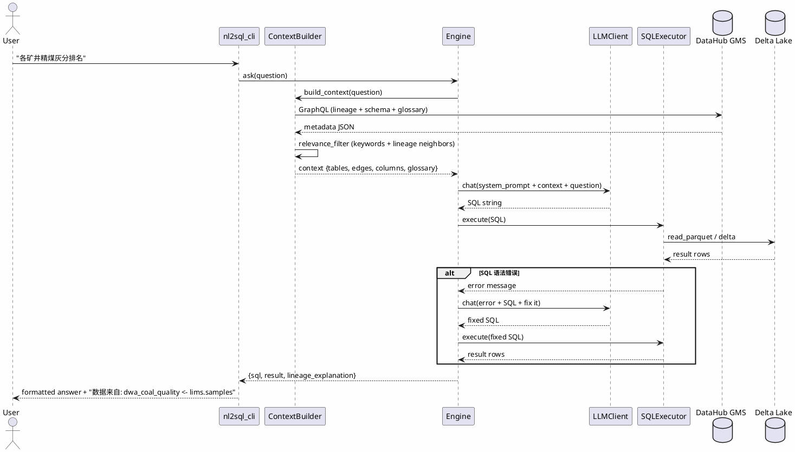

## Context

项目已完成 DataHub 血缘录入（`lineage_recipe.yaml` 8 条表级边）、DWA 宽表构建（sales_daily / tag_alarm / coal_quality / dwa_sales_production）、GE 质量检测。`DataHubClient`（`src/dg_platform/datahub_client.py`）已具备 GraphQL `list_datasets` / `get_lineage` 能力。DuckDB 已在 `build_dwa_models.py` 中使用，能查 Delta Lake / Parquet。

当前缺口：字段业务词典、列级血缘、NL2SQL 引擎。LLM 采用 MiniMax-M2.7-highspeed（OpenAI 兼容协议，`__REDACTED_API_URL__`）。

## Goals / Non-Goals

**Goals:**
- 让业务人员用自然语言查询 DWA/DWD 数据
- DataHub 血缘图作为 NL2SQL 的核心上下文（表选择 + JOIN 路径 + 字段映射）
- 字段词典消除业务术语歧义（"精煤" -> `SAMPLE_TYPE='精煤'`）
- 返回结果附带血缘解释（数据从哪来、怎么加工的）

**Non-Goals:**
- 不做实时流式 NL2SQL（Demo 用批查 Delta Lake）
- 不做全量列级血缘（只补 DWA←DWD 关键路径）
- 不做多轮对话（单次生成 + 至多 1 次修正）
- 不做生产级权限控制（Demo 无 auth）
- 不替代 BI 看板（Superset 仍是正式报表工具）

## Decisions

### Decision 1: LLM 客户端 — httpx/requests 直调 OpenAI 兼容 API

选择 `requests` 直接 POST `/v1/chat/completions`。

- **理由**：项目已有 `requests` 依赖，零新增依赖；MiniMax-M2.7 兼容 OpenAI 协议，直接 POST 即可
- **备选 A**：`openai` Python SDK（更规范，但增加依赖且对第三方兼容端点支持需验证）
- **备选 B**：`langchain`（过重，Demo 不需要链式编排）
- **选定**：requests 直调

### Decision 2: SQL 执行引擎 — DuckDB

选择 DuckDB 直接查 Delta Lake / Parquet 文件。

- **理由**：项目已在 `build_dwa_models.py` 中使用 DuckDB；单机内存足够（DWA < 100MB）；支持复杂 SQL + JOIN
- **备选 A**：Spark SQL（太重，启动慢，Demo 不合适）
- **备选 B**：pandas（复杂 SQL 支持差，多表 JOIN 笨拙）
- **选定**：DuckDB

### Decision 3: 上下文构建 — GMS GraphQL 实时拉取 + 本地 fallback

从 DataHub GMS GraphQL 实时拉取血缘 + schema + glossary，结构化为 context JSON。GMS 不可用时 fallback 到本地 `lineage_recipe.yaml` + `pyarrow` 读 schema。

- **理由**：保证上下文与 DataHub 一致（"血缘驱动"卖点）；fallback 保证 Demo 在 GMS 宕机时仍可演示
- **备选**：纯本地 YAML（简单但与 DataHub 脱节，失去核心卖点）
- **选定**：GraphQL 优先 + 本地 fallback

### Decision 4: 列级血缘存储 — lineage_recipe.yaml 扩展 columnMappings + GMS upstreamColumnLineage

在 `lineage_recipe.yaml` 中扩展 `columnMappings` 字段，`emit_lineage.py` 读取后写入 GMS `upstreamColumnLineage` aspect。

- **理由**：与现有 recipe 一致，YAML 易读易改；GMS aspect 供 GraphQL 查询
- **备选**：纯 GMS aspect（查询方便但写入复杂，脱离 recipe 体系）
- **选定**：YAML + GMS 双写

### Decision 5: Prompt 策略 — 单次生成 + SQL 校验修正

单次 LLM 生成 SQL -> DuckDB 语法校验 -> 失败时带错误信息再调一次 LLM 修正（最多 1 次）。

- **理由**：Demo 场景问题简单，单次成功率高；修正机制兜底语法错误
- **备选**：多轮 ReAct / Function Calling（复杂，Demo 过度设计）
- **选定**：单次 + 1 次修正

### Decision 6: 上下文注入粒度 — 按问题相关性裁剪

不把全部 12 张表 schema 都塞给 LLM，根据问题关键词 + 血缘邻接表筛选 top-N 相关表（1-2 跳邻居）。

- **理由**：控制 token，提升准确率（无关表干扰 LLM）
- **备选**：全量注入（简单但 token 爆炸 + 干扰）
- **选定**：相关性裁剪

### 架构组件图

```plantuml
@startuml
skinparam componentStyle rectangle
skinparam backgroundColor #FEFEFE

package "DataHub GMS (existing)" {
    [GMS GraphQL API] as GMS
    database "MySQL\n(metadata_aspect)" as DB
    [OpenSearch Index] as ES
    GMS --> DB
    GMS --> ES
}

package "Delta Lake (existing)" {
    [DWA宽表\nsales_daily/tag_alarm/\ncoal_quality/sales_production] as DWA
    [DWD清洗表] as DWD
}

package "NL2SQL Module (NEW)" {
    [ContextBuilder] as CB
    [LLMClient] as LLM
    [Engine] as ENG
    [SQLExecutor\n(DuckDB)] as SQL

    CB --> ENG : context JSON
    LLM --> ENG : SQL string
    ENG --> SQL : execute
    SQL --> DWA : read_parquet
    SQL --> DWD : read_parquet
}

actor "业务用户" as USER
USER --> [nl2sql_cli.py] as CLI
CLI --> ENG : natural language question
ENG --> USER : result + lineage explanation

CB --> GMS : GraphQL\n(lineage+schema+glossary)
CB ..> [lineage_recipe.yaml] as RECIPE : fallback
CB ..> DWA : fallback (pyarrow schema)
@enduml
```

### NL2SQL 处理时序图



## Risks / Trade-offs

| 风险 | 缓解措施 |
|---|---|
| LLM 生成错误 SQL | DuckDB 执行失败 -> 带错误回灌 LLM 修正（最多 1 次），仍失败则返回错误 + 建议 |
| 血缘覆盖不全导致表选错 | 上下文构建器加 fallback：关键词匹配 schema 字段名补充候选表 |
| 业务术语歧义 | 词典覆盖不全时，Prompt 中加"如遇未知术语请用最接近的字段"提示 |
| GMS 宕机 | fallback 到本地 `lineage_recipe.yaml` + `pyarrow` 读 schema |
| LLM API 延迟/不可用 | 超时 30s + 错误提示；Demo 可预跑缓存结果 |
| 列级血缘维护成本 | 只补 DWA←DWD 关键路径，不全做 |

## Migration Plan

1. **Task 1-2**（元数据增强）：字段词典 + 列级血缘，纯增量，不影响现有功能
2. **Task 3-4**（NL2SQL 模块）：`src/dg_nl2sql/` 新模块独立，不触碰现有代码
3. **Task 5**（测试验证）：新脚本，不修改现有流程
4. **回滚**：删除 `src/dg_nl2sql/` + `scripts/nl2sql_*.py` + `scripts/emit_glossary.py`；DataHub 新 aspect 可保留（无害）或按 URN 清理；`lineage_recipe.yaml` 的 `columnMappings` 为可选字段，删除即回滚

## Open Questions

- 测试问题是否覆盖"数据孤岛"场景（`lims.samples` 与 `sap_erp.vbak` 无字面 JOIN）？**建议是**，验证 NL2SQL 能识别并提示"无法跨系统 JOIN"
- 是否需要把 NL2SQL 查询审计回写 DataHub？**建议 Phase 2 再做**，本次不实现
